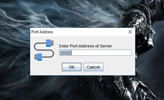
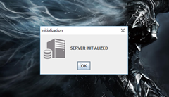
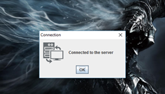
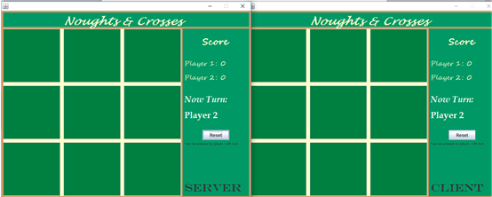
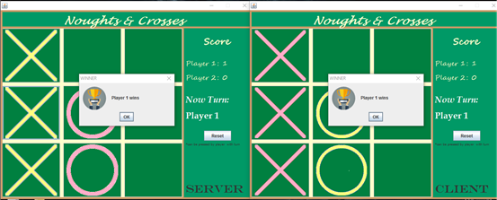

# socket-programming-java

This Tic Tac Toe game is implemented on the concepts of distributed computing.

It uses socket programming to connect client and server and play with each other. This is done by Java Sockets DataInputStream and DataOutputStream.
GUI is created by Java AWT and Spring libraries.

**Snapshot**

Client Server Connection through IP and Port:

 

 

